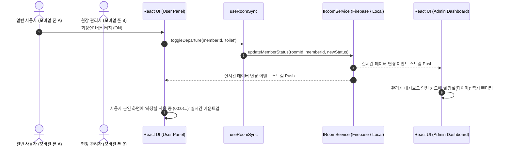

# Architecture — 실시간 출결 및 자리비움 현황판 (Count & Status Sync)

> 소유자: architect | 상태: 승인 | 최종 수정: 2026-08-24
> 상태는 초안/승인 두 가지. 사용자 승인 완료됨 (AGENTS.md 파이프라인 규칙).

## 기술 스택

| 계층 | 선택 | 선택 이유 (DECISIONS/ADR 참조) |
|---|---|---|
| 언어 | TypeScript | 도메인 모델, 상태 인터페이스의 엄격한 타입 안정성 보장 |
| 프론트엔드 | React 18/19 + Vite | 빠른 HMR, 경량 번들링, 모바일 컴포넌트 생태계 |
| 스타일링 | Vanilla CSS (CSS Modules / Modern Tokens) | Tailwind 의존성 없이 세밀한 글래스모피즘, 모바일 터치 피드백, 테마 제어 |
| PWA | vite-plugin-pwa | 스마트폰 홈 화면 추가 및 독립 실행형 앱(standalone) 지원 |
| 실시간 저장소 | Firebase Realtime DB / LocalBroadcast (듀얼 어댑터) | 2인 실시간 동기화 및 로컬 시연/테스트 완벽 지원 (ADR-0001) |
| 테스트 | Vitest + React Testing Library | 고속 단위/도메인/컴포넌트 테스트 및 TDD 지원 |

## 구조 개요

```
src/
├── domain/                      # 순수 비즈니스 로직 및 엔티티 (프레임워크 무관)
│   ├── types.ts                 # Room, Member, StatusLog, DepartureType 등 모델
│   ├── member-logic.ts          # 출결 토글, 상태 전환, 타임로그 계산 순수 함수
│   └── time-formatter.ts        # 경과 시간(HH:MM:SS) 포맷팅 및 타임스탬프 유틸
├── services/                    # 저장소 및 실시간 동기화 어댑터 (Clean Architecture)
│   ├── room-service.interface.ts # IRoomService 인터페이스 정의
│   ├── local-broadcast.service.ts# BroadcastChannel & LocalStorage 기반 로컬 실시간 어댑터
│   ├── firebase.service.ts      # Firebase Realtime DB 기반 원격 실시간 어댑터
│   └── service-factory.ts       # 환경 설정 기반 어댑터 주입 팩토리
├── hooks/                       # UI 상태 바인딩 훅
│   ├── use-room-sync.ts         # 실시간 룸 상태 구독 및 액션 디스패치
│   ├── use-timer.ts             # 1초 주기 실시간 경과 시간 계산 훅
│   └── use-theme.ts             # 다크/라이트 테마 관리
├── components/                  # UI 컴포넌트
│   ├── common/                  # Modal, Drawer, Button, Toast, Badge
│   ├── join/                    # 룸 생성/입장 화면, 역할 선택 (관리자 PIN vs 사용자 이름)
│   ├── dashboard/               # 관리자 메인 현황판, 상단 통계 바, 인원 카드 그리드
│   ├── user-panel/              # 일반 사용자 본인 전용 원터치 제어 패널
│   └── modals/                  # 인원 추가/수정 모달, 기타 사유 입력 모달, 타임로그 뷰어
├── styles/                      # 전역 디자인 시스템
│   ├── variables.css            # HSL 컬러 팔레트, 글래스모피즘 토큰, 타이포그래피
│   └── index.css                # 글로벌 리셋 및 모바일 레이아웃 기본 스타일
└── App.tsx                      # 라우팅 및 룸 컨텍스트 프로바이더
```

## 모듈 경계와 책임

| 모듈 | 책임 | 의존 대상 |
|---|---|---|
| `domain` | 회원 출결 상태 전이 규칙, 자리비움 타이머 및 로그 생성 순수 비즈니스 로직 | 없음 (순수 TS) |
| `services` | 원격 DB/로컬 채널과의 데이터 송수신 및 실시간 구독 관리 (`IRoomService` 구현) | `domain` |
| `hooks` | React 생명주기 및 컴포넌트 상태와 Service/Domain 연결 | `domain`, `services` |
| `components` | 모바일 최적화 터치 인터페이스 및 시각화 | `domain`, `hooks` |

## 데이터 흐름



## 데이터 모델과 인터페이스

| 엔티티/인터페이스 | 규격 (필드·타입·제약) | 사용 모듈 |
|---|---|---|
| `DepartureType` | `'none' \| 'toilet' \| 'smoking' \| 'etc'` | `domain`, `components` |
| `StatusLog` | `{ id: string; type: DepartureType; reason?: string; startAt: number; endAt?: number; durationSeconds?: number }` | `domain`, `services`, `components` |
| `Member` | `{ id: string; name: string; isPresent: boolean; activeStatus: DepartureType; activeReason?: string; departureTime?: number; logs: StatusLog[] }` | `domain`, `services`, `components` |
| `Room` | `{ roomId: string; pin: string; createdAt: number; members: Record<string, Member> }` | `domain`, `services` |
| `IRoomService` | `createRoom(), getRoom(), updateMember(), toggleAttendance(), toggleDeparture(), resetRoom(), subscribeRoom()` | `services`, `hooks` |

### 계층 규칙 (Clean Architecture)

| 항목 | 결정 |
|---|---|
| 의존성 방향 | Domain ← Services (Port/Adapter) ← Hooks ← Components (UI) |
| Repository 포트 | `IRoomService`를 선언하고 `FirebaseService`, `LocalBroadcastService`가 구현 |
| DTO ↔ 도메인 변환 위치 | Service 어댑터 계층 내부에서 변환 완료 후 Domain 객체 전달 |
| 순환 의존성 | 금지 (정적 분석 및 린트로 강제) |

## 테스트 전략

| 항목 | 결정 |
|---|---|
| 테스트 프레임워크 | Vitest + `@testing-library/react` |
| 테스트 디렉토리 배치 | `tests/unit/` (도메인 로직), `tests/services/` (어댑터), `tests/components/` (UI 컴포넌트) |
| 커버 범위 기준 | 도메인 로직 및 서비스 어댑터 100%, 핵심 컴포넌트 인터랙션 검증 |
| Mock/Stub 대상 (외부 의존성) | Firebase SDK는 Mock 인터페이스로 격리하여 단위 테스트 수행 |

## 배포

| 항목 | 결정 |
|---|---|
| 호스팅 / 실행 대상 | Vercel / Netlify / Firebase Hosting (정적 SPA 호스팅) |
| 빌드·릴리스 파이프라인 | `npm run test` 통과 후 `npm run build`로 `dist/` 생성 |
| 환경과 승격 | 로컬 개발(`npm run dev`) ➡️ 프로덕션 빌드 배포 |
| 환경별 설정 | `.env.example` 기반 `VITE_FIREBASE_*` 설정 (미설정 시 로컬 모드로 자동 동작) |
| DB·상태 마이그레이션 | NoSQL Key-Value / Document 구조 (버전 필드 포함) |
| 롤백 절차 | 정적 호스팅 플랫폼 이전 배포 버전 원클릭 롤백 (< 1분) |
| 헬스체크 / 스모크 테스트 | 빌드 후 번들 스모크 테스트 및 PWA 서비스워커 등록 검증 |

## 에러 처리

| 항목 | 결정 |
|---|---|
| 예외를 잡는 위치 | Service 계층에서 네트워크 오류를 포착하여 Result/Error 객체로 래핑 후 Hook에 전달 |
| 실패가 사용자에게 드러나는 방식 | 모바일 하단 Toast 알림 팝업 및 직관적인 에러 안내 텍스트 표시 |
| 경계 간 전파 | 표준 `AppError` 타입 객체 반환 (`{ success: boolean, error?: string }`) |

## 관측성

| 항목 | 결정 |
|---|---|
| 로깅 | 브라우저 콘솔 로깅 (`[SyncService]`, `[Domain]` 프리픽스) |
| 에러 추적 / 모니터링 | MVP는 전역 `window.onerror` 및 콘솔 에러 로깅으로 대체 |
| 메트릭 | MVP에서는 실시간 룸 접속자 수 및 동기화 지연시간 콘솔 메트릭 제공 |

## 주요 결정

결정 기록은 [DECISIONS.md](DECISIONS.md)와 [adr/0001-realtime-storage-and-dual-adapter.md](adr/0001-realtime-storage-and-dual-adapter.md)에 상세히 기록되어 있다.
