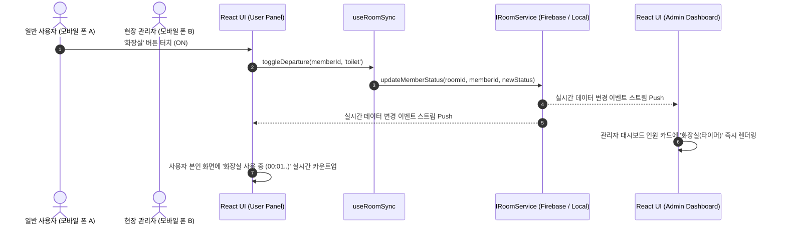
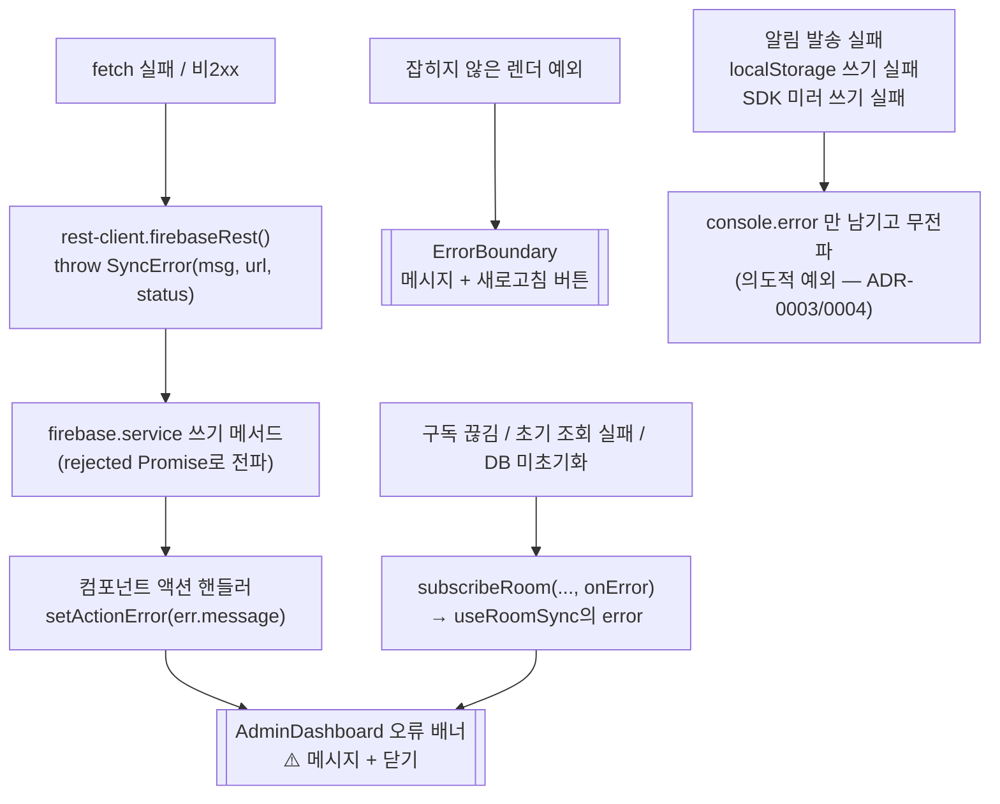

# Architecture — 실시간 출결 및 자리비움 현황판 (Count & Status Sync)

> 소유자: architect | 상태: 승인 | 최종 수정: 2026-08-25
> 상태는 초안/승인 두 가지. 사용자 승인 완료됨 (AGENTS.md 파이프라인 규칙).
>
> **2026-08-25 사후 개정 — 재승인 대기.** 배포 후 긴급 대응 과정에서 내려진 결정 5건(DECISIONS #4~#8, ADR-0002~0005)을 반영했다. 구현·배포가 이미 완료된 상태의 **사후 기록**이며, 개정분은 아직 사용자 승인을 받지 않았다. 문서 상태 열의 "승인"은 개정 이전 내용에 대한 것이다 — 상태 전환은 사용자만 한다.

## 기술 스택

| 계층 | 선택 | 선택 이유 (DECISIONS/ADR 참조) |
|---|---|---|
| 언어 | TypeScript | 도메인 모델, 상태 인터페이스의 엄격한 타입 안정성 보장 |
| 프론트엔드 | React 18/19 + Vite | 빠른 HMR, 경량 번들링, 모바일 컴포넌트 생태계 |
| 스타일링 | Vanilla CSS (CSS Modules / Modern Tokens) | Tailwind 의존성 없이 세밀한 글래스모피즘, 모바일 터치 피드백, 테마 제어 |
| PWA / 서비스워커 | vite-plugin-pwa (Workbox, `registerType: 'autoUpdate'`) | 홈 화면 추가·standalone 실행, 그리고 모바일 알림의 유일한 경로인 `registration.showNotification()` 확보 (ADR-0004) |
| 실시간 저장소 | Firebase Realtime DB / LocalBroadcast (듀얼 어댑터) | 2인 실시간 동기화 및 로컬 시연/테스트 완벽 지원 (ADR-0001) |
| 원격 전송 방식 | Firebase REST(`firebaseRest`) + SDK 미러 이중 쓰기 | REST는 즉시성·오류 노출, SDK는 실시간 구독 담당 (ADR-0003 / 제약은 ADR-0005 남은 한계 3번) |
| DB 접근 제어 | `firebase.rules.json` (규칙만 강화, 인증 없음) | 사용자 선택 "규칙만 강화 (코드 변경 없음)" — 열거 차단 + 스키마 검증 (ADR-0005) |
| 테스트 | Vitest + React Testing Library | 고속 단위/도메인/컴포넌트 테스트 및 TDD 지원 |

## 구조 개요

```
src/
├── domain/                      # 순수 비즈니스 로직 및 엔티티 (프레임워크 무관)
│   ├── types.ts                 # Room, Member, StatusLog, DepartureType 등 모델
│   ├── member-logic.ts          # 출결 토글, 상태 전환, 타임로그 계산 순수 함수
│   ├── room-normalizer.ts       # [신규] RTDB 스냅샷 → 도메인 모델 정규화 (ADR-0002)
│   └── time-formatter.ts        # 경과 시간(HH:MM:SS) 포맷팅 및 타임스탬프 유틸
├── services/                    # 저장소 및 실시간 동기화 어댑터 (Clean Architecture)
│   ├── room-service.interface.ts # IRoomService 인터페이스 + SyncErrorCallback 정의
│   ├── local-broadcast.service.ts# BroadcastChannel & LocalStorage 기반 로컬 실시간 어댑터
│   ├── firebase.service.ts      # Firebase Realtime DB 기반 원격 실시간 어댑터 (REST + SDK 미러)
│   ├── firebase-config.ts       # [신규] 배포 환경변수 정제 sanitizeConfigValue() (ADR-0002)
│   ├── rest-client.ts           # [신규] firebaseRest() + SyncError — 실패를 던지는 REST 게이트 (ADR-0003)
│   ├── notification.service.ts  # [신규] 서비스워커 우선 무음 알림, 실패 무전파 (ADR-0004)
│   ├── room-history.ts          # [신규] 이 기기의 접속 룸 기록 (localStorage, 최대 10개) (ADR-0005)
│   └── service-factory.ts       # 환경 설정 기반 어댑터 주입 팩토리
├── hooks/                       # UI 상태 바인딩 훅
│   ├── use-room-sync.ts         # 실시간 룸 상태 구독 + onError → error 상태 노출
│   ├── use-admin-notifications.ts # [신규] 관리자용 상태 변화 알림 디스패치
│   ├── use-timer.ts             # 1초 주기 실시간 경과 시간 계산 훅
│   └── use-theme.ts             # 다크/라이트 테마 관리
├── components/                  # UI 컴포넌트
│   ├── common/                  # Modal, Badge, ErrorBoundary [신규] (ADR-0003)
│   ├── join/                    # 룸 생성/입장 화면, 역할 선택 (관리자 PIN vs 사용자 이름)
│   ├── dashboard/               # 관리자 메인 현황판, 상단 통계 바, 인원 카드 그리드, 오류 배너
│   ├── user-panel/              # 일반 사용자 본인 전용 원터치 제어 패널
│   └── modals/                  # 인원 추가/수정, 기타 사유, 타임로그 뷰어, RoomListModal(기기 기록 기반)
├── styles/                      # 전역 디자인 시스템
│   ├── variables.css            # HSL 컬러 팔레트, 글래스모피즘 토큰, 타이포그래피
│   └── index.css                # 글로벌 리셋 및 모바일 레이아웃 기본 스타일
├── main.tsx                     # 루트 마운트 + ErrorBoundary를 App 바깥 최상단에 배치
│                                #   (서비스워커 등록은 vite-plugin-pwa가 자동 주입)
└── App.tsx                      # 화면 전환(세션 기반) 및 룸 컨텍스트 프로바이더

리포 루트:
├── vite.config.ts               # VitePWA(매니페스트·Workbox 런타임 캐싱) 설정
└── firebase.rules.json          # RTDB 보안 규칙 (열거 차단 + 스키마 검증) (ADR-0005)
```

## 모듈 경계와 책임

| 모듈 | 책임 | 의존 대상 |
|---|---|---|
| `domain` | 회원 출결 상태 전이 규칙, 자리비움 타이머 및 로그 생성 순수 비즈니스 로직 | 없음 (순수 TS) |
| `services` | 원격 DB/로컬 채널과의 데이터 송수신 및 실시간 구독 관리 (`IRoomService` 구현) | `domain` |
| `hooks` | React 생명주기 및 컴포넌트 상태와 Service/Domain 연결 | `domain`, `services` |
| `components` | 모바일 최적화 터치 인터페이스 및 시각화 | `domain`, `hooks` |

### 2026-08-25 추가 모듈 (사후 기록)

| 모듈 | 책임 (한 줄) | 계층 | 의존 대상 | 근거 |
|---|---|---|---|---|
| `services/firebase-config.ts` | 배포 플랫폼이 넣은 환경변수 원문에서 감싼 따옴표·공백·끝 슬래시를 걷어내 설정값으로 만든다 | 서비스(어댑터 경계, 순수 함수) | 없음 | ADR-0002 |
| `domain/room-normalizer.ts` | RTDB가 생략한 `members`·`adminMemberIds`·`logs`·`activeStatus`를 채워 도메인이 가정하는 형태의 `Room`을 만든다 | 도메인(입력 정규화, 순수 함수) | `domain/types` | ADR-0002 |
| `services/rest-client.ts` | 모든 Firebase REST 호출의 단일 통로로서 네트워크 실패·비2xx를 `SyncError`로 던진다 | 서비스(전송 게이트) | 없음 | ADR-0003 |
| `services/notification.service.ts` | 서비스워커 우선 경로로 무음 알림을 발송하되 어떤 실패도 호출자에게 전파하지 않는다 | 서비스(플랫폼 어댑터) | 브라우저 Notification/ServiceWorker API | ADR-0004 |
| `services/room-history.ts` | 이 기기가 접속한 룸을 localStorage에 최대 10개 기록·조회·제거한다 (서버 열거 대체) | 서비스(로컬 저장소 어댑터) | 브라우저 localStorage | ADR-0005 |
| `components/common/ErrorBoundary.tsx` | 렌더 예외를 앱 루트에서 잡아 빈 화면 대신 오류 메시지와 새로고침 버튼을 보인다 | UI(최상위 경계) | React | ADR-0003 |
| `hooks/use-admin-notifications.ts` | 룸 상태 변화를 감지해 관리자에게 알림 발송을 요청한다 | 훅 | `services/notification.service`, `domain` | ADR-0004 |
| `firebase.rules.json` (리포 루트) | RTDB 열거를 차단하고 룸 노드 스키마를 검증한다 (앱 코드 아님, 콘솔 게시물) | 인프라 설정 | 없음 | ADR-0005 |

**정규화 모듈을 `domain`에 둔 이유**: `normalizeRoom()`은 "도메인 모델이 성립하기 위한 최소 조건"을 정의하는 함수이며 Firebase SDK 타입에 의존하지 않는다(`raw: any` 입력). 서비스 어댑터가 도메인을 향해 의존하는 방향(Domain ← Services)이 유지된다.

## 데이터 흐름



### 오류 전파 경로 (2026-08-25 추가, ADR-0003)



## 데이터 모델과 인터페이스

| 엔티티/인터페이스 | 규격 (필드·타입·제약) | 사용 모듈 |
|---|---|---|
| `DepartureType` | `'none' \| 'toilet' \| 'smoking' \| 'etc'` | `domain`, `components` |
| `StatusLog` | `{ id: string; type: DepartureType; reason?: string; startAt: number; endAt?: number; durationSeconds?: number }` | `domain`, `services`, `components` |
| `Member` | `{ id: string; name: string; isPresent: boolean; activeStatus: DepartureType; activeReason?: string; departureTime?: number; logs: StatusLog[] }` | `domain`, `services`, `components` |
| `Room` | `{ roomId: string; pin: string; adminMemberIds?: string[]; createdAt: number; members: Record<string, Member> }` | `domain`, `services` |
| `IRoomService` | `createRoom(), getRoom(), listRooms(), deleteRoom(), verifyPin(), setAdminMembers(), addMember(), updateMember(), deleteMember(s), toggleAttendance(), setDeparture(), resetDaily(), subscribeRoom()` | `services`, `hooks` |

### 2026-08-25 추가 인터페이스 (사후 기록)

| 엔티티/인터페이스 | 규격 (필드·타입·제약) | 사용 모듈 |
|---|---|---|
| `SyncError` | `class SyncError extends Error { name: 'SyncError'; url: string; status?: number }` — 메시지는 상태코드별 한국어 안내 + `[HTTP nnn]` + 응답 본문 앞 200자 | `services`, `hooks`, `components` |
| `SyncErrorCallback` | `(message: string) => void` — 실시간 구독이 끊기거나 거부됐을 때의 통지 | `services`, `hooks` |
| `IRoomService.subscribeRoom` | `subscribeRoom(roomId: string, callback: RoomChangeCallback, onError?: SyncErrorCallback): () => void` — `onError`는 선택 파라미터라 로컬 어댑터는 미구현 가능 | `services`, `hooks` |
| `firebaseRest` | `firebaseRest(url: string, init?: RequestInit): Promise<any>` — 성공 시 파싱된 JSON, 실패 시 **반드시 `SyncError` throw** (null 반환 금지) | `services` |
| `sanitizeConfigValue` | `(raw: string \| undefined \| null) => string \| undefined` — 짝이 맞는 앞뒤 따옴표만 반복 제거, `trim`, 끝 슬래시 제거, 빈 문자열은 `undefined` | `services` |
| `normalizeRoom` / `normalizeMember` | `(raw: any) => Room \| null` / `(raw: any) => Member` — `members`·`adminMemberIds`·`logs`는 항상 배열/객체 보장, `activeStatus` 기본값 `'none'`, `isPresent`는 `=== true` 판정 | `domain`, `services` |
| `RoomHistoryEntry` | `{ roomId: string; role: 'admin' \| 'user'; visitedAt: number }` — 저장 키 `count_status_room_history`, 상한 `ROOM_HISTORY_LIMIT = 10`, `visitedAt` 내림차순 | `services`, `components` |
| `NotifyOptions` | `{ tag?: string; requireInteraction?: boolean }` — 발송은 `sendNotification(title, body, options): Promise<boolean>`, 항상 `silent: true`, 예외 대신 `false` 반환 | `services`, `hooks` |

### 계층 규칙 (Clean Architecture)

| 항목 | 결정 |
|---|---|
| 의존성 방향 | Domain ← Services (Port/Adapter) ← Hooks ← Components (UI) |
| Repository 포트 | `IRoomService`를 선언하고 `FirebaseService`, `LocalBroadcastService`가 구현 |
| DTO ↔ 도메인 변환 위치 | Service 어댑터 계층 내부에서 `normalizeRoom()`을 호출해 변환 완료 후 Domain 객체 전달 (읽기 경로 전부) |
| 순환 의존성 | 금지 (정적 분석 및 린트로 강제) |
| 외부 입력 정제 지점 | 환경변수는 `firebase-config.sanitizeConfigValue()`, 저장소 스냅샷은 `room-normalizer.normalizeRoom()` — 경계 밖에서 개별 방어(옵셔널 체이닝) 금지 (ADR-0002) |
| 원격 전송 단일 통로 | 모든 Firebase REST 호출은 `rest-client.firebaseRest()`를 거친다 — `fetch` 직접 호출 금지 (ADR-0003) |

## PWA / 서비스워커 계층

| 항목 | 결정 |
|---|---|
| 도입 이유 | ① 홈 화면 추가(standalone) ② **모바일 알림의 유일한 경로**인 `registration.showNotification()` 확보 (ADR-0004) |
| 등록 방식 | `vite-plugin-pwa`의 `registerType: 'autoUpdate'` — 등록 코드는 플러그인이 자동 주입하며 `main.tsx`는 관여하지 않는다 |
| 매니페스트 | `display: 'standalone'`, `orientation: 'portrait'`, `start_url`/`scope` = `/`, 아이콘 192/512/maskable-512 |
| 프리캐시 대상 | `**/*.{js,css,html,png,svg,ico}` (앱 셸만) |
| 런타임 캐싱 정책 | Firebase RTDB(`https://*.firebasedatabase.app/*`) = **NetworkOnly** — 오래된 현황이 캐시되면 안 된다. Google Fonts = CacheFirst(1년, 최대 20개) |
| 알림 발송 경로 | 1순위 `navigator.serviceWorker.ready` → `registration.showNotification()`, 2순위 데스크톱 `new Notification()` |
| 알림 정책 | `silent: true` (Web Audio 경고음 전량 삭제 — 사용자 요구), 중복 방지용 `tag`, 실패 시 예외 대신 `false` 반환 |
| 권한 처리 | `getNotificationPermission()` / `requestNotificationPermission()` 모두 예외를 삼키고 `'denied'`로 폴백 — Notification API 부재 환경 대응 |

## 화면 전환과 화면 상태

| 항목 | 결정 |
|---|---|
| 라우팅 | URL 라우터 없음 — `App.tsx`가 `UserSession`(localStorage `count_status_user_session`) 유무·`role`로 JoinScreen / AdminDashboard / UserControlPanel을 분기한다. PWA `start_url`이 `/` 하나이므로 경로 라우팅이 불필요하다 |
| 세션 저장 부수효과 | 세션 저장 시점에 `recordRoomVisit(roomId, role)`가 호출되어 기기 룸 기록이 갱신된다 (ADR-0005) |
| 로딩 상태 | `useRoomSync`의 구독 전 상태 + `RoomListModal`의 `isLoading` (기기 기록을 먼저 그리고 인원수는 개별 조회로 나중에 채우는 2단계 렌더) |
| 빈 상태 | 룸 목록: 기기 기록 0건이면 안내 문구. 룸 개별 조회 실패 시 해당 행에 `missing` 표시 |
| 에러 상태 | `AdminDashboard`가 `error`(구독 계열, `clearError()`로 해제)와 `actionError`(액션 계열)를 하나의 배너로 표시 |
| 최후 방어선 | 앱 루트 `ErrorBoundary` — 위 어느 상태로도 잡히지 않은 렌더 예외에서 빈 화면 대신 메시지 + 새로고침 버튼 |
| 재사용 컴포넌트 경계 | `components/common/` (Modal, Badge, ErrorBoundary)만 화면 간 공유. 화면별 컴포넌트는 각 폴더에 가둔다 |
| 시각 디자인 | 해당 없음 — 타이포·색·모션은 설계 대상이 아니며 구현 단계 몫 (AGENTS.md 설계 권한 범위) |

## 테스트 전략

| 항목 | 결정 |
|---|---|
| 테스트 프레임워크 | Vitest + `@testing-library/react` |
| 테스트 디렉토리 배치 | `tests/unit/` (도메인 로직), `tests/services/` (어댑터), `tests/components/` (UI 컴포넌트) |
| 커버 범위 기준 | 도메인 로직 및 서비스 어댑터 100%, 핵심 컴포넌트 인터랙션 검증 |
| Mock/Stub 대상 (외부 의존성) | Firebase SDK는 Mock 인터페이스로 격리하여 단위 테스트 수행 |
| **2026-08-25 추가 테스트 대상** | ① `sanitizeConfigValue()` — 따옴표 감싼 값·한쪽만 따옴표·끝 슬래시·빈 문자열 (정상1+경계2+예외2) ② `normalizeRoom()` — `logs`/`members`/`adminMemberIds` 키 부재, `null` 입력 ③ `firebaseRest()` — 2xx 성공, 404/401 SyncError의 `status`·메시지, `fetch` reject ④ `room-history` — 상한 10 초과, 중복 roomId 갱신, localStorage 부재 ⑤ `sendNotification()` — 권한 미허용 시 `false`, `showNotification` reject 시 예외 없이 `false` |
| 실행 환경 주의 | `vite.config.ts`의 `test.environment`가 `'node'`다. DOM/localStorage/Notification에 의존하는 위 ④⑤와 컴포넌트 테스트는 `jsdom` 환경 지정 또는 스텁이 필요하다 — 하네스 현황 확인 후 정리 대상 (Open Question) |

## 배포

| 항목 | 결정 |
|---|---|
| 호스팅 / 실행 대상 | Vercel (정적 SPA 호스팅) — 실제 배포 대상 |
| 빌드·릴리스 파이프라인 | `npm run test` 통과 후 `npm run build`로 `dist/` 생성 (검증된 원문은 docs/CodingRules.md "검증된 명령어") |
| 환경과 승격 | 로컬 개발(`npm run dev`) ➡️ 프로덕션 빌드 배포 |
| 환경별 설정 | `.env.example` 기반 `VITE_FIREBASE_*` 설정 (미설정 시 로컬 모드로 자동 동작) |
| **배포 플랫폼 환경변수 취급 (2026-08-25 추가)** | Vercel 대시보드 값은 dotenv 파싱을 거치지 않고 원문 그대로 번들에 인라인된다. 따라서 값을 신뢰하지 않고 `sanitizeConfigValue()`로 런타임 정제한 뒤 사용한다 (ADR-0002). 대시보드에는 따옴표 없이 입력하는 것이 원칙이지만, 코드가 그 원칙에 의존하지 않는다 |
| **DB 보안 규칙 배포 (2026-08-25 추가)** | `firebase.rules.json`은 앱 번들과 별도로 Firebase 콘솔에서 게시한다. **코드 배포와 규칙 게시는 별개 절차이며 순서가 중요하다** — 규칙을 `auth != null`로 바꿀 때는 SDK 경로 정리 코드와 반드시 동시 배포 (ADR-0005 남은 한계 3번) |
| DB·상태 마이그레이션 | NoSQL Key-Value / Document 구조. RTDB가 빈 값 키를 생략하므로 스키마 변경 시 `room-normalizer.ts`의 기본값 채우기를 함께 갱신한다 |
| 롤백 절차 | Vercel 이전 배포 버전 원클릭 롤백 (< 1분). **단, 서비스워커 캐시가 남을 수 있으므로 롤백 후 강제 새로고침이 필요할 수 있다** (`autoUpdate`로 완화하나 즉시성은 보장 안 됨 — 추정, 실기기 확인 필요) |
| 룸 데이터 영구 삭제·복구 | 앱에서 불가(규칙의 `newData.exists()`가 삭제 차단). **Firebase 콘솔에서 사람이 수행**한다 (ADR-0005) |
| 헬스체크 / 스모크 테스트 | 미검증 — 배포 후 PWA 서비스워커 등록 및 실기기 동기화 확인 절차가 정의되어 있지 않다. QA 단계에서 정의 필요 (Open Question) |

## 에러 처리

> **2026-08-25 개정**: 종전 규약(`{ success, error }` Result 래핑)은 실제 코드가 따르지 않았고, 모든 실패가 `console.warn` / `.catch(() => {})`로 삼켜져 클라우드 저장이 통째로 실패해도 화면에 아무 표시가 없었다. 아래가 현행 규약이다 (ADR-0003).

| 항목 | 결정 |
|---|---|
| 기본 원칙 | **Fail-loud** — 동기화 실패를 삼키지 않는다. 저장되지 않은 것을 저장된 줄 아는 것보다, 작업이 중단되고 오류가 표시되는 편이 낫다 |
| 예외를 만드는 위치 | `rest-client.firebaseRest()` — 네트워크 실패와 비2xx 응답을 `SyncError`로 **throw** (`url`·`status` 첨부, 401/403·404·5xx별 한국어 안내) |
| 경계 간 전파 | 쓰기 실패는 `IRoomService` 메서드의 rejected Promise로 훅·컴포넌트까지 전파. 구독 계열 실패는 `subscribeRoom(..., onError)` → `useRoomSync`의 `error` 상태 |
| 실패가 사용자에게 드러나는 방식 | `AdminDashboard` 상단 오류 배너(`⚠️ {error \| actionError}` + 닫기 버튼). 별도 Toast 컴포넌트는 도입하지 않았다 |
| 렌더 예외 | 앱 루트 `ErrorBoundary`가 잡아 오류 메시지 + 새로고침 버튼 표시 (검은 화면 금지) |
| 의도적으로 삼키는 경로 (예외 3곳) | ① 알림 발송(`notification.service`) — 전파하면 React 트리가 무너져 검은 화면이 된다 ② `room-history` localStorage 쓰기 ③ SDK 미러 쓰기. 세 경로 모두 `console.error`는 남기며, 핵심 데이터 정합성에 영향이 없다 |
| 재시도 / 오프라인 큐 | 해당 없음 — PRD에 요구가 없다. 필요해지면 별도 ADR로 도입 |

## 관측성

| 항목 | 결정 |
|---|---|
| 로깅 | 브라우저 콘솔 로깅. 프리픽스 규약: `[Notification]`, `[room-history]`, `[LocalBroadcastService]` 등 **모듈명 대괄호 프리픽스** |
| 로그 레벨 규약 (2026-08-25 개정) | 삼키는 실패는 `console.warn`이 아니라 **`console.error`**로 남긴다 — `warn`은 브라우저 기본 필터에서 묻혀 이번 장애를 은폐했다 (ADR-0003) |
| 에러 추적 / 모니터링 | 외부 추적 서비스 없음. `ErrorBoundary`가 렌더 예외를 잡아 화면에 표시하고 콘솔에 기록 |
| 사용자 대면 관측 | 오류 배너에 상태코드별 원인 힌트(권한 거부 / 주소 없음 / 서버 오류)를 넣어, 개발자 콘솔 없이도 설정 오류와 권한 오류를 구별할 수 있게 한다 |
| 메트릭 | 해당 없음 — 실시간 접속자 수·동기화 지연 메트릭은 구현되지 않았다. PRD 요구가 아니며 부스 규모(수십 명)에서 필요성이 낮다 |
| 원격 로그 수집 | 해당 없음 — 프런트 전용 정적 SPA이고 수집 백엔드가 없다. 모바일 장애 재현은 Android Chrome 원격 디버깅으로 대체 |

## 주요 결정

| ADR | 제목 | 상태 |
|---|---|---|
| [ADR-0001](adr/0001-realtime-storage-and-dual-adapter.md) | 실시간 동기화 스토리지 및 듀얼 어댑터 구조 | 승인 |
| [ADR-0002](adr/0002-normalize-external-data-at-boundaries.md) | 외부에서 들어오는 값은 경계에서 정제·정규화한다 | 제안 (사후 기록) |
| [ADR-0003](adr/0003-fail-loud-sync-error-propagation.md) | 동기화 실패를 삼키지 않고 사용자에게 노출한다 | 제안 (사후 기록) |
| [ADR-0004](adr/0004-pwa-service-worker-notifications.md) | 알림은 서비스워커 경로로 보내고 실패를 전파하지 않는다 (PWA 도입) | 제안 (사후 기록) |
| [ADR-0005](adr/0005-rules-only-security-and-device-room-history.md) | DB 보안은 규칙만 강화, 룸 목록은 기기 접속 기록으로 | 제안 (사후 기록) |

한 줄 결정 로그는 [DECISIONS.md](DECISIONS.md) 참조.

## 알려진 잔여 항목 (2026-08-25)

| # | 항목 | 성격 | 근거 |
|---|---|---|---|
| 1 | **인증 없음** — 룸 코드를 아는 사람의 읽기·수정을 막지 못한다. 부스 실운영 전 익명 인증 전환 필요 | 보안 한계 (사용자가 "규칙만 강화"를 선택한 결과) | ADR-0005 남은 한계 1~2 |
| 2 | **REST/SDK 이중 쓰기** — REST 경로가 인증 토큰을 싣지 않아, 규칙을 `auth != null`로 바꾸면 전부 401이 된다 | 위 전환의 핵심 제약 | ADR-0005 남은 한계 3 |
| 3 | `IRoomService.listRooms()`가 인터페이스에 남아 있으나 `RoomListModal`은 더 이상 사용하지 않는다 (Firebase 구현은 규칙상 401) | 죽은 인터페이스 — 정리 대상 | `src/services/room-service.interface.ts:36`, `src/components/modals/RoomListModal.tsx:41` |
| 4 | Android 실기기에서 검은 화면 해소·`showNotification` 동작이 **미검증** | QA 필요 | ADR-0004 |
| 5 | `normalizeRoom()` 호출 강제 수단(린트 규칙 등) 없음 — 새 읽기 경로에서 누락 가능 | 잔여 위험 (수용) | ADR-0002 |
